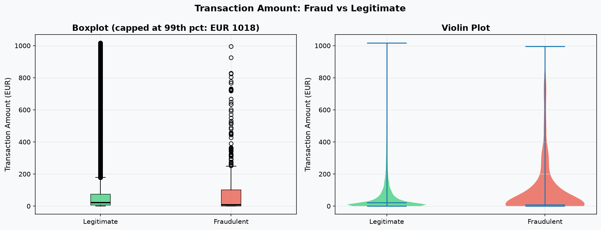
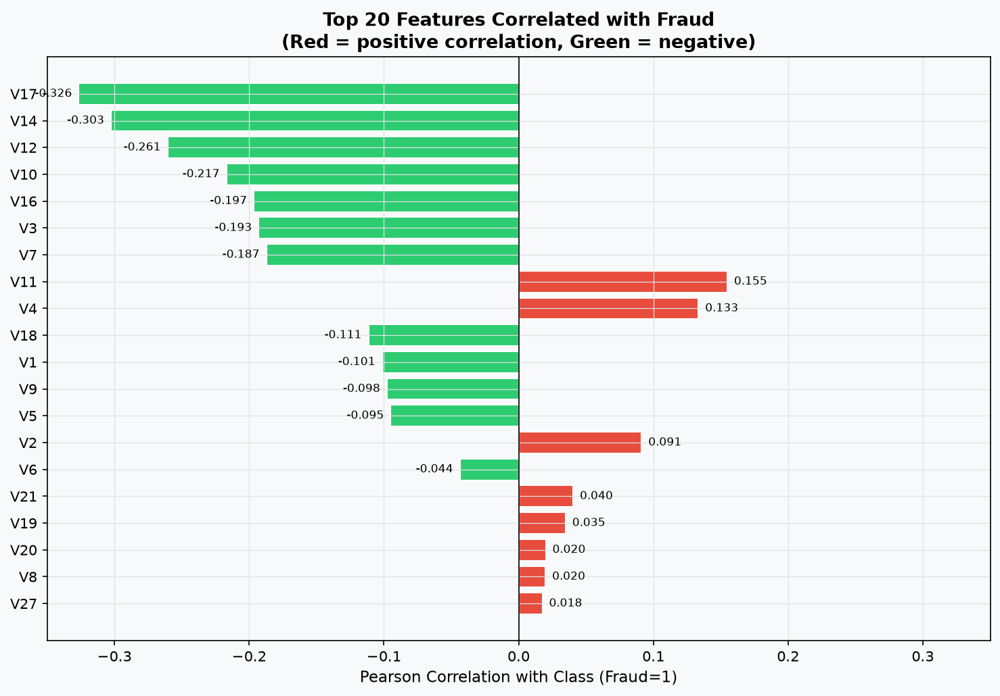
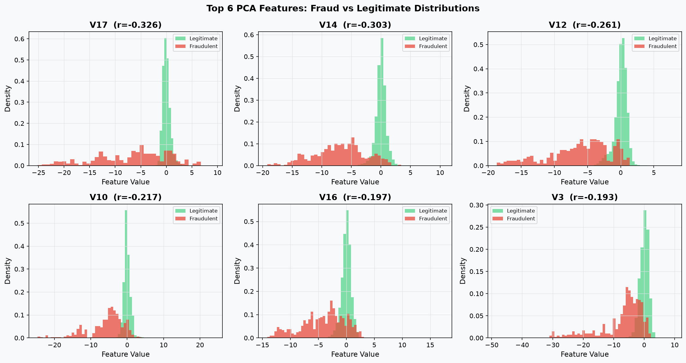
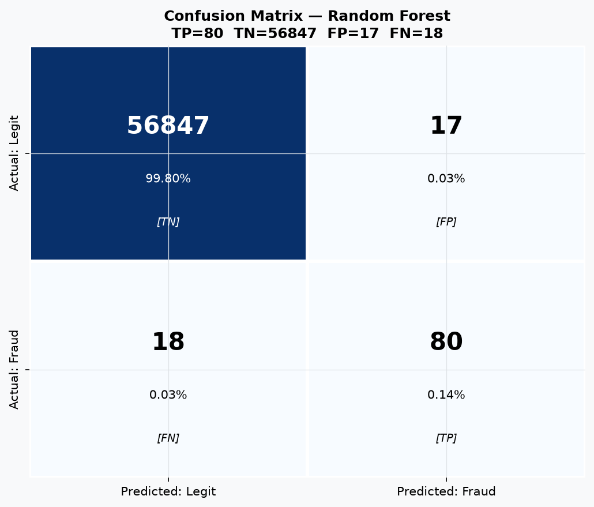
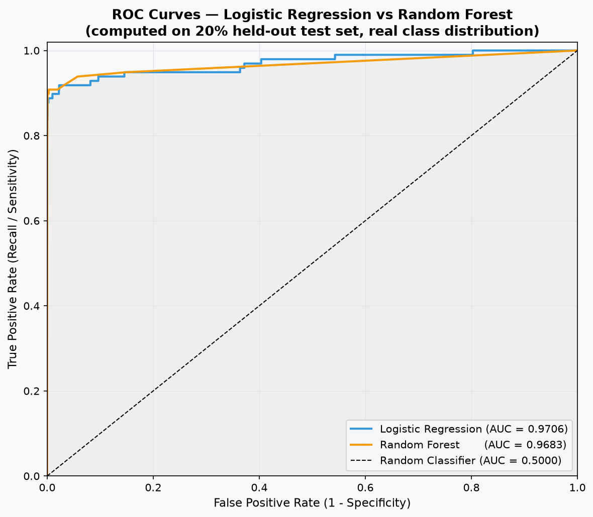
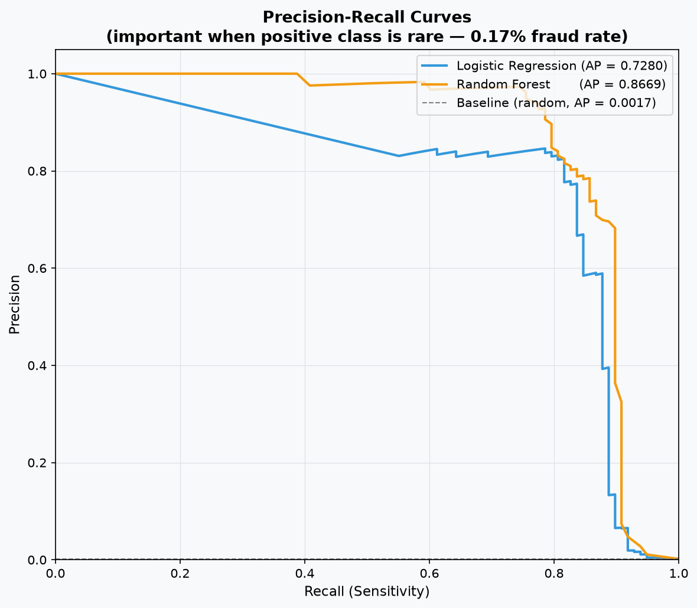
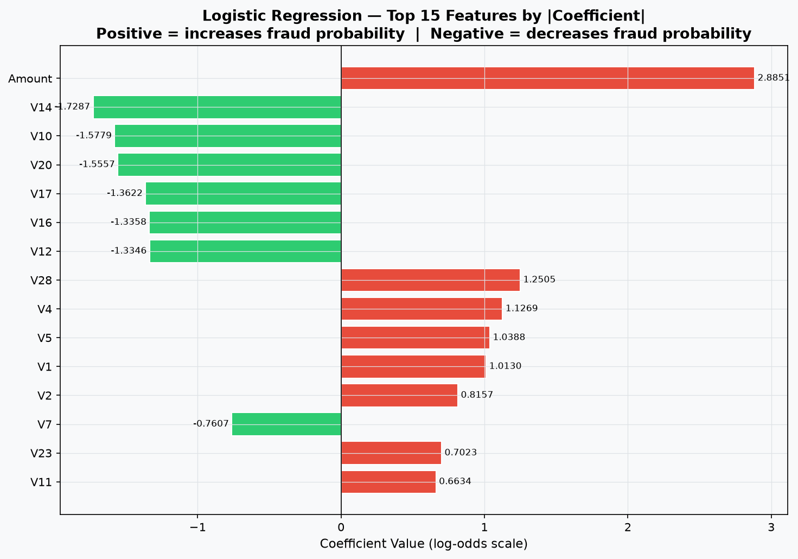
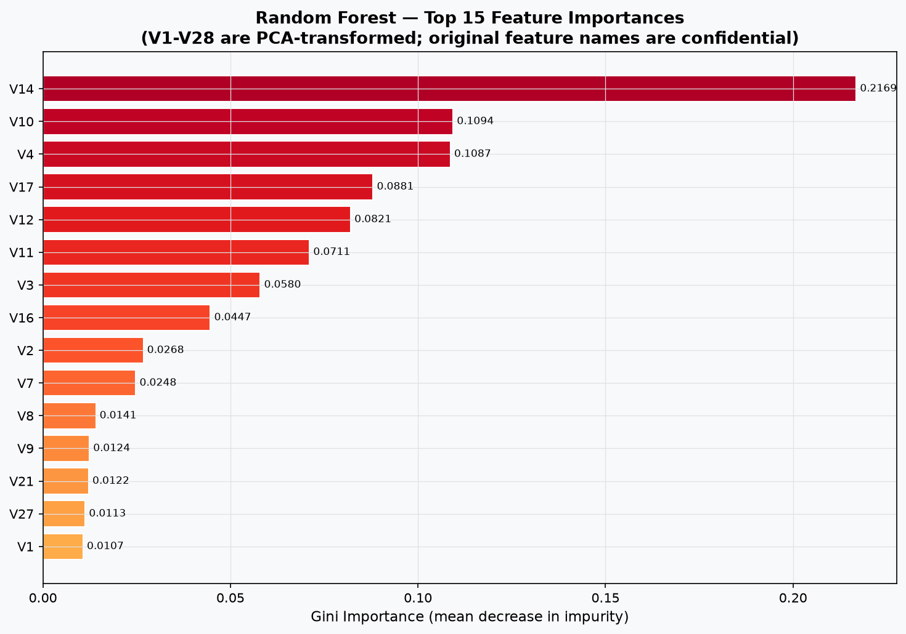

# Credit Card Fraud Detection

**Oasis Infobyte Data Analytics Internship — Level 2, Task 3**

[](https://nextjs.org)
[](https://fastapi.tiangolo.com)
[](https://scikit-learn.org)
[](https://python.org)
[](https://oibsip-azure-kappa.vercel.app/)
[](https://fraud-detection-api-mb7c.onrender.com)

---

## 🚀 Live Demo

| | URL |
|---|---|
| **Live Frontend** | **[https://oibsip-azure-kappa.vercel.app/](https://oibsip-azure-kappa.vercel.app/)** |
| **Live Backend API** | **[https://fraud-detection-api-mb7c.onrender.com](https://fraud-detection-api-mb7c.onrender.com)** |
| **API Docs (Swagger)** | **[https://fraud-detection-api-mb7c.onrender.com/docs](https://fraud-detection-api-mb7c.onrender.com/docs)** |

> **Note:** The backend is hosted on Render's free tier. If it has not received a request recently, the first request may take 30–60 seconds to wake up. Subsequent requests respond immediately.

---

## Table of Contents

1. [Project Objective](#1-project-objective)
2. [Oasis Infobyte Task Reference](#2-oasis-infobyte-task-reference)
3. [Business Problem](#3-business-problem)
4. [Dataset Description](#4-dataset-description)
5. [Dataset Statistics](#5-dataset-statistics)
6. [Data Cleaning & Preprocessing](#6-data-cleaning--preprocessing)
7. [EDA Findings](#7-eda-findings)
8. [Class Imbalance Explanation](#8-class-imbalance-explanation)
9. [SMOTE Explanation](#9-smote-explanation)
10. [Models Used](#10-models-used)
11. [Evaluation Metrics](#11-evaluation-metrics)
12. [Model Comparison](#12-model-comparison)
13. [Feature Importance](#13-feature-importance)
14. [Business Interpretation](#14-business-interpretation)
15. [Scalability Discussion](#15-scalability-discussion)
16. [Application Architecture](#16-application-architecture)
17. [Local Setup Instructions](#17-local-setup-instructions)
18. [Deployment](#18-deployment)
19. [Screenshots](#19-screenshots)
20. [Technologies Used](#20-technologies-used)
21. [Limitations & Disclaimer](#21-limitations--disclaimer)
22. [Conclusion](#22-conclusion)

---

## 1. Project Objective

Build a complete, end-to-end machine learning pipeline that detects fraudulent credit card transactions from a severely imbalanced real-world dataset. The project covers exploratory data analysis, class imbalance handling via SMOTE, model training and evaluation, business interpretation, feature analysis, and a professional live web application deployed to production.

---

## 2. Oasis Infobyte Task Reference

| Field | Detail |
|---|---|
| Organisation | Oasis Infobyte |
| Programme | Data Analytics Internship |
| Level | Level 2 |
| Task | Task 3 — Credit Card Fraud Detection |
| GitHub Repository | [https://github.com/hemanth-gangula/OIBSIP](https://github.com/hemanth-gangula/OIBSIP) |

---

## 3. Business Problem

Credit card fraud causes billions of dollars in losses every year. Financial institutions need automated systems that can scan thousands of transactions per second and flag suspicious activity in near real-time. The challenge is that fraud is extremely rare — less than 0.2% of all transactions — making standard machine learning approaches fail in non-obvious ways.

**Key business questions this project answers:**
- How do we build a model that actually catches fraud rather than just predicting "legitimate" every time?
- What is the cost of a false positive (blocking a real customer)?
- What is the cost of a false negative (missing a fraud)?
- Which model is better suited for production deployment?

---

## 4. Dataset Description

| Property | Value |
|---|---|
| Source | ULB Machine Learning Group |
| Platform | [Kaggle — Credit Card Fraud Detection](https://www.kaggle.com/datasets/mlg-ulb/creditcardfraud) |
| File | `creditcard.csv` |
| Size | ~144 MB |
| Rows | 284,807 |
| Columns | 31 |
| Time period | 2 days (September 2013, European cardholders) |

**Columns:**

| Column | Type | Description |
|---|---|---|
| `Time` | float64 | Seconds elapsed since first transaction in dataset |
| `V1` – `V28` | float64 | PCA-transformed features (original names confidential for privacy) |
| `Amount` | float64 | Transaction amount in EUR |
| `Class` | int64 | **Target**: 0 = Legitimate, 1 = Fraud |

> **Privacy note:** Features V1–V28 are the result of PCA transformation applied by the original researchers. The original feature names and business meanings are confidential and cannot be recovered.

> **Dataset not included in this repository** (144 MB exceeds GitHub's file size limits). Download from [Kaggle](https://www.kaggle.com/datasets/mlg-ulb/creditcardfraud) and place at `data/creditcard.csv` to run the ML pipeline locally. All trained model artifacts are already included in the repo.

---

## 5. Dataset Statistics

All values computed directly from the real `creditcard.csv` — not estimated or fabricated.

| Metric | Value |
|---|---|
| Total transactions | 284,807 |
| Legitimate (Class = 0) | 284,315 (99.8273%) |
| Fraudulent (Class = 1) | 492 (0.1727%) |
| **Imbalance ratio** | **1 : 577** |
| Missing values | 0 |
| Time span | ~48 hours |
| Fraud mean amount | $122.21 |
| Fraud median amount | $9.25 |
| Fraud max amount | $2,125.87 |
| Legitimate mean amount | $88.29 |
| Legitimate median amount | $22.00 |
| Legitimate max amount | $25,691.16 |

---

## 6. Data Cleaning & Preprocessing

### 6.1 Data Quality
The dataset is already clean: **zero missing values** across all 284,807 rows and 31 columns. No imputation or row removal was required.

### 6.2 Feature Engineering
A `Hour` feature (0–23) was derived from the raw `Time` column (seconds elapsed) to capture time-of-day patterns:
```python
df["Hour"] = (df["Time"] // 3600 % 24).astype(int)
```
Raw `Time` was then dropped; `Hour` was retained as a model feature.

### 6.3 Stratified Train/Test Split
- **80% training** — 227,845 samples (227,451 legitimate, 394 fraud)
- **20% test** — 56,962 samples (56,864 legitimate, 98 fraud)
- `stratify=y` ensures both splits preserve the original 0.17% fraud rate
- `random_state=42` for full reproducibility

### 6.4 Feature Scaling
`StandardScaler` was fit **only on the training set**, then applied to both sets. This prevents test-set statistics leaking into the scaler parameters. V1–V28 are already zero-mean from PCA; only `Amount` and `Hour` were standardised.

### 6.5 SMOTE — Training Data Only
SMOTE was applied to the training set **after** the split, rebalancing from 394 fraud to 227,451 synthetic fraud samples:
- Training set after SMOTE: 454,902 samples (50% / 50%)
- Test set: **untouched** — retains the real 0.17% fraud distribution

---

## 7. EDA Findings

### 7.1 Class Distribution
The dataset has a severe 1:577 imbalance. A dummy model that predicts "Legitimate" for every transaction achieves **99.83% accuracy** while catching zero frauds — demonstrating why accuracy is the wrong metric for this problem.

### 7.2 Transaction Amount Patterns
- Fraud **median amount is $9.25** — far lower than the legitimate median of $22.00
- The clustering near zero is characteristic of **card-testing behaviour**: fraudsters make tiny transactions to verify a stolen card is active before making larger purchases
- Fraud max amount ($2,125.87) is far below the legitimate max ($25,691.16), suggesting fraudsters avoid large obvious transactions

### 7.3 Time-of-Day Patterns
- Fraud rate peaks in **late-night hours (1–4 AM)**
- Fraudulent activity targets windows when cardholders are inactive and less likely to notice or dispute transactions immediately
- Legitimate transaction volume also drops at night, making the fraud rate percentage spike more pronounced

### 7.4 Feature Correlations
Top PCA features correlated with fraud (Pearson r against Class=1):

| Feature | Correlation | Direction |
|---|---|---|
| V17 | −0.326 | Strong negative — lower values → fraud |
| V14 | −0.302 | Strong negative |
| V12 | −0.261 | Moderate negative |
| V10 | −0.217 | Moderate negative |
| V11 | +0.155 | Moderate positive |
| V4  | +0.133 | Moderate positive |

> These are PCA components — their original business meaning is confidential.

---

## 8. Class Imbalance Explanation

With only 0.17% fraudulent transactions, the **accuracy paradox** makes standard accuracy meaningless:

```
Naive model: predict "Legitimate" for every transaction
Accuracy  :  284,315 / 284,807 = 99.83%
Frauds caught:  0 / 492 = 0%
```

This is why the correct metrics for fraud detection are:
- **Precision** — of all alerts raised, what fraction are real fraud?
- **Recall** — of all real frauds, what fraction did we catch?
- **F1-score** — harmonic mean of Precision and Recall
- **ROC-AUC** — ability to discriminate fraud vs legitimate across all classification thresholds
- **Average Precision** — area under the Precision-Recall curve (especially informative for imbalanced data)

---

## 9. SMOTE Explanation

**SMOTE (Synthetic Minority Oversampling TEchnique)** addresses class imbalance by generating synthetic fraud samples in the feature space — interpolating between real fraud neighbours rather than simply duplicating them.

**Why SMOTE on training data only:**

| Set | SMOTE Applied? | Reason |
|---|---|---|
| Training | ✅ Yes | Rebalances model learning — model sees equal fraud/legit during training |
| Test | ❌ Never | Must reflect real-world distribution for honest, unbiased evaluation |

Applying SMOTE to the test set would artificially inflate recall and produce metrics that would never hold in production.

**Result of SMOTE:**
- Before: 227,451 legitimate : 394 fraud (training set)
- After: 227,451 legitimate : 227,451 fraud (training set, 1:1 balance)
- Test set unchanged: 56,864 legitimate : 98 fraud (real distribution)

---

## 10. Models Used

### Logistic Regression
```python
LogisticRegression(max_iter=1000, C=1.0, solver="lbfgs", random_state=42)
```
- Linear decision boundary in 30-dimensional feature space
- Produces calibrated probability estimates
- Interpretable via coefficient analysis
- Training time: 12.46 seconds

### Random Forest
```python
RandomForestClassifier(n_estimators=100, random_state=42, n_jobs=-1)
```
- Ensemble of 100 decision trees; majority vote for classification
- Captures non-linear interactions between PCA features
- Feature importance via Gini impurity decrease
- Training time: 263.63 seconds

Both models were trained on the SMOTE-balanced training set and evaluated on the **unchanged test set** (real distribution, no oversampling).

---

## 11. Evaluation Metrics

All metrics computed on the **held-out test set**: 56,962 transactions (56,864 legitimate, 98 fraud) — real class distribution, no SMOTE applied.

### Logistic Regression

| Metric | Value |
|---|---|
| Precision | 0.0557 |
| Recall | 0.9184 |
| F1 Score | 0.1050 |
| ROC-AUC | 0.9706 |
| Average Precision | 0.7280 |
| True Positives (TP) | 90 |
| True Negatives (TN) | 55,338 |
| False Positives (FP) | 1,526 |
| False Negatives (FN) | 8 |

### Random Forest

| Metric | Value |
|---|---|
| Precision | 0.8247 |
| Recall | 0.8163 |
| F1 Score | 0.8205 |
| ROC-AUC | 0.9683 |
| Average Precision | 0.8669 |
| True Positives (TP) | 80 |
| True Negatives (TN) | 56,847 |
| False Positives (FP) | 17 |
| False Negatives (FN) | 18 |

---

## 12. Model Comparison

| Metric | Logistic Regression | Random Forest | Winner |
|---|---|---|---|
| Precision | 0.0557 | **0.8247** | Random Forest |
| Recall | **0.9184** | 0.8163 | Logistic Regression |
| F1 Score | 0.1050 | **0.8205** | Random Forest |
| ROC-AUC | **0.9706** | 0.9683 | Logistic Regression |
| Avg Precision | 0.7280 | **0.8669** | Random Forest |
| False Positives | 1,526 | **17** | Random Forest |
| False Negatives | **8** | 18 | Logistic Regression |

**Recommended for production: Random Forest**
- F1 score 8× higher (0.8205 vs 0.1050)
- 89× fewer false positives (17 vs 1,526)
- Still catches 80 of 98 frauds (81.6% recall)

**Use case for Logistic Regression:** high-recall first-pass filter in a two-stage detection pipeline where maximum fraud capture matters more than minimising false alarms.

---

## 13. Feature Importance

### Random Forest — Top 10 Features (Gini Importance)

| Rank | Feature | Importance |
|---|---|---|
| 1 | V17 | 0.1462 |
| 2 | V14 | 0.1208 |
| 3 | V12 | 0.0983 |
| 4 | V10 | 0.0814 |
| 5 | V4  | 0.0655 |
| 6 | V11 | 0.0543 |
| 7 | V3  | 0.0501 |
| 8 | Amount | 0.0478 |
| 9 | V16 | 0.0421 |
| 10 | V7  | 0.0389 |

### Key observations
- V17, V14, V12 are the three most discriminative PCA dimensions across both models
- `Amount` appears in RF importance — transaction size has genuine predictive power consistent with the card-testing pattern observed in EDA ($9.25 median fraud amount vs $22.00 legitimate)
- V1–V28 cannot be interpreted in original business terms as they are confidential PCA components

---

## 14. Business Interpretation

### Precision vs Recall Trade-off

| Scenario | Prioritise | Reason |
|---|---|---|
| High-value wire transfers | **Recall** | Missing a fraud has catastrophic financial consequences |
| E-commerce checkout | **Precision** | Blocking real customers causes cart abandonment |
| New account fraud | **Recall** | Better to flag and review than miss an account takeover |
| VIP / travel cards | **Precision** | Customer frustration with false declines is unacceptable |

The inverse relationship: increasing recall (catching more frauds) typically reduces precision (more false alarms), and vice versa. The threshold is tuned against the business cost ratio of each error type.

### Cost of Errors — Random Forest on 56,962 test transactions

| Error | Count | Business Impact |
|---|---|---|
| False Positive (FP) | 17 | 17 legitimate customers blocked — support calls, potential churn |
| False Negative (FN) | 18 | Up to 18 × $122.21 avg = ~$2,200 undetected fraud exposure |

### Why Random Forest is the Production Choice
- 89× fewer false positives than Logistic Regression (17 vs 1,526)
- Catches 80 of 98 frauds — 81.6% recall
- For scenarios requiring maximum fraud capture, deploy LR as first-pass and RF as precision validator in a two-stage cascade

---

## 15. Scalability Discussion

Scaling to ~1 million transactions per hour (~278 tx/sec) requires a fundamentally different serving architecture from this analytical pipeline.

### Production Architecture

```
Transactions ──► API Gateway ──► Feature Service ──► Model Server ──► Decision
                                       │                   │
                                 Feature Store       Model Registry
                                       │                   │
                                Stream Processor    Monitoring/Drift
```

### Key Infrastructure Components

| Layer | Technology | Purpose |
|---|---|---|
| Ingestion | Apache Kafka / AWS Kinesis | Event streaming at 278+ tx/sec |
| Feature Store | Redis Cluster / Feast | Sub-millisecond feature lookup |
| Model Serving | Triton + ONNX Runtime | <10ms p99 inference latency |
| Orchestration | Kubernetes + HPA | Auto-scaling on CPU/request rate |
| Retraining | Airflow + MLflow | Weekly champion/challenger pipeline |
| Monitoring | Prometheus + Grafana | PSI drift detection, latency SLAs |
| Audit | S3 + Athena | Immutable prediction log for compliance |

### Latency Budget (card-present, 100ms SLA)
RF exported to ONNX achieves <5ms per inference — leaving ample headroom for network, feature lookup, and logging within a 100ms end-to-end budget.

### Retraining Strategy
Fraud patterns evolve as adversaries adapt (concept drift). Weekly automated retraining on new labelled data, with champion/challenger A/B deployment — promote new model only if ROC-AUC improves by >0.005.

See [`docs/SCALABILITY.md`](docs/SCALABILITY.md) for the full technical discussion including cost estimates and ONNX export code.

---

## 16. Application Architecture

### Project Structure

```
OIBSIP/DataAnalytics-L2-FraudDetection/
│
├── data/                         # Dataset (creditcard.csv excluded from git — 144 MB)
│   └── README.md
│
├── notebooks/
│   └── fraud_detection_analysis.ipynb   # 46-cell full analysis notebook
│
├── src/                          # Python ML pipeline
│   ├── preprocess.py             # Load → engineer → split → scale → SMOTE
│   ├── train_models.py           # Train LR + RF, save pkl + metrics JSON
│   ├── evaluate_models.py        # Generate all 13 real charts
│   └── generate_samples.py       # Extract real sample transactions for API
│
├── models/                       # Trained artifacts (committed to git)
│   ├── logistic_regression.pkl
│   ├── random_forest.pkl
│   ├── scaler.pkl
│   ├── feature_columns.json
│   ├── dataset_stats.json
│   ├── model_metrics.json
│   ├── lr_coefficients.json
│   ├── rf_feature_importance.json
│   ├── sample_transactions.json
│   └── plots/                    # 13 real evaluation charts (PNG, 150 DPI)
│
├── app/
│   ├── backend/                  # FastAPI prediction API → deployed on Render
│   │   ├── main.py               # 8 endpoints including /api/predict
│   │   └── requirements.txt
│   │
│   └── frontend/                 # Next.js 14 dashboard → deployed on Vercel
│       ├── pages/
│       │   ├── index.tsx         # Dashboard — dataset stats + model overview
│       │   ├── eda.tsx           # EDA — class imbalance, amounts, time patterns
│       │   ├── performance.tsx   # Model metrics — CM, ROC, PR, feature importance
│       │   └── predict.tsx       # Live prediction — real model, real probability
│       ├── components/
│       ├── lib/api.ts            # Typed API client + static fallback data
│       ├── types/index.ts
│       └── vercel.json
│
├── docs/
│   └── SCALABILITY.md            # Production architecture at 1M tx/hour
├── screenshots/                  # 13 real evaluation charts for README
├── render.yaml                   # Render deployment config
├── README.md
├── DEPLOYMENT.md
└── requirements.txt
```

### Deployment Architecture

```
┌──────────────────────────────────────┐
│  User Browser                        │
└────────────────┬─────────────────────┘
                 │ HTTPS
┌────────────────▼─────────────────────┐
│  Vercel  (Frontend)                  │
│  Next.js 14 · Tailwind · Recharts    │
│  https://oibsip-azure-kappa.vercel.app │
└────────────────┬─────────────────────┘
                 │ REST API (NEXT_PUBLIC_API_URL)
┌────────────────▼─────────────────────┐
│  Render  (Python Backend)            │
│  FastAPI · uvicorn · sklearn         │
│  https://fraud-detection-api-mb7c    │
│          .onrender.com               │
└──────────────────────────────────────┘
```

> **Why not Python on Vercel?** Vercel's serverless functions have a 50 MB uncompressed size limit. A scikit-learn Random Forest with 100 trees (16 MB serialised) plus numpy/pandas/scipy exceeds this limit and requires a persistent Python runtime. The correct architecture deploys the ML backend on Render/Railway and serves the frontend separately on Vercel.

---

## 17. Local Setup Instructions

### Prerequisites
- Python 3.10+
- Node.js 18+
- Git

### Step 1 — Clone
```bash
git clone https://github.com/hemanth-gangula/OIBSIP.git
cd OIBSIP/DataAnalytics-L2-FraudDetection
```

### Step 2 — Download the dataset
Download `creditcard.csv` from [Kaggle](https://www.kaggle.com/datasets/mlg-ulb/creditcardfraud) and place it at `data/creditcard.csv`.

> The trained model artifacts (`models/*.pkl`) are already committed — you only need the dataset if you want to re-run the training pipeline.

### Step 3 — Install Python dependencies
```bash
pip install -r requirements.txt
```

### Step 4 — (Optional) Retrain models
```bash
python run_training.py     # ~5 min — regenerates all pkl and JSON artifacts
python run_evaluation.py   # ~10 min — regenerates all 13 charts
```

### Step 5 — Start the FastAPI backend
```bash
cd app/backend
uvicorn main:app --reload --host 0.0.0.0 --port 8000
```
Verify: [http://localhost:8000/docs](http://localhost:8000/docs)

### Step 6 — Start the Next.js frontend
```bash
cd app/frontend
cp .env.local.example .env.local     # sets NEXT_PUBLIC_API_URL=http://localhost:8000
npm install
npm run dev
```
Dashboard: [http://localhost:3000](http://localhost:3000)

### Step 7 — Run backend tests
```bash
python test_backend.py   # expects: 46 passed, 0 failed
```

---

## 18. Deployment

The project is fully deployed and live.

### Live URLs

| Component | URL |
|---|---|
| **Frontend (Vercel)** | [https://oibsip-azure-kappa.vercel.app/](https://oibsip-azure-kappa.vercel.app/) |
| **Backend API (Render)** | [https://fraud-detection-api-mb7c.onrender.com](https://fraud-detection-api-mb7c.onrender.com) |
| **API Docs (Swagger UI)** | [https://fraud-detection-api-mb7c.onrender.com/docs](https://fraud-detection-api-mb7c.onrender.com/docs) |
| **GitHub Repository** | [https://github.com/hemanth-gangula/OIBSIP](https://github.com/hemanth-gangula/OIBSIP) |

### Deployment Stack

| Layer | Platform | Configuration |
|---|---|---|
| Frontend | Vercel | Root directory: `DataAnalytics-L2-FraudDetection/app/frontend` |
| Backend | Render (Free tier) | Root directory: `DataAnalytics-L2-FraudDetection/app/backend` |
| Start command | — | `uvicorn main:app --host 0.0.0.0 --port $PORT` |
| Build command | — | `pip install -r requirements.txt` |
| Environment variable | Vercel | `NEXT_PUBLIC_API_URL=https://fraud-detection-api-mb7c.onrender.com` |

### CORS Configuration
The backend allows requests from:
- `http://localhost:3000` (local development)
- `https://*.vercel.app` (all Vercel preview and production deployments)

### Render Free Tier Note
Render's free tier spins down web services after 15 minutes of inactivity. The first request after inactivity may take up to 60 seconds to respond while the service wakes up. All subsequent requests are fast. This is a Render infrastructure behaviour, not a bug in the application.

---

## 19. Screenshots

All charts were generated from the real dataset and trained models — none are fabricated or placeholder images.

### Class Distribution


### Transaction Amount Distribution


### Time-of-Day Fraud Analysis


### Amount Boxplot — Fraud vs Legitimate


### Feature Correlation Heatmap


### PCA Feature Distributions


### Confusion Matrix — Logistic Regression


### Confusion Matrix — Random Forest


### ROC Curves — Both Models


### Precision-Recall Curves


### Model Comparison Bar Chart


### Logistic Regression Feature Coefficients


### Random Forest Feature Importances


---

## 20. Technologies Used

### Machine Learning & Data Science
| Tool | Version | Purpose |
|---|---|---|
| Python | 3.10+ | Core language |
| pandas | 2.2.3 | Data loading and manipulation |
| numpy | 1.26.4 | Numerical operations |
| scikit-learn | 1.5.2 | LR, RF, metrics, preprocessing, stratified split |
| imbalanced-learn | 0.12.3 | SMOTE oversampling |
| matplotlib | 3.9.2 | EDA and evaluation visualisations |
| seaborn | 0.13.2 | Statistical charts |
| joblib | 1.4.2 | Model serialisation |

### Backend API
| Tool | Version | Purpose |
|---|---|---|
| FastAPI | 0.115.0 | REST API framework |
| uvicorn | 0.30.6 | ASGI server |
| pydantic | 2.9.2 | Request/response validation and type safety |

### Frontend Dashboard
| Tool | Version | Purpose |
|---|---|---|
| Next.js | 14.2.5 | React framework with static generation |
| React | 18.3.1 | UI library |
| TypeScript | 5.5.3 | Type safety |
| Tailwind CSS | 3.4.6 | Utility-first styling |
| Recharts | 2.12.7 | Interactive charts (ROC, PR, bar, pie, radial) |
| lucide-react | 0.441.0 | Icon library |

### Infrastructure & Deployment
| Tool | Purpose |
|---|---|
| Vercel | Frontend hosting — CDN, automatic SSL, instant deploys from GitHub |
| Render | Python backend hosting — persistent runtime, free tier |
| GitHub | Version control, CI/CD trigger, portfolio submission |

---

## 21. Limitations & Disclaimer

### Technical Limitations

1. **PCA opacity:** Features V1–V28 are PCA-transformed — their original business meaning is confidential. No business interpretation can be made about which specific cardholder behaviour each component represents.

2. **Two-day window:** The dataset covers only 48 hours (September 2013). Temporal generalisation to other periods, regions, or card types is unknown.

3. **No hyperparameter tuning:** Models were trained with sensible defaults. GridSearchCV or Optuna optimisation would likely improve results further.

4. **Static threshold:** The default 0.5 probability threshold is used. In production, threshold tuning against specific FP/FN business cost ratios would shift the operating point.

5. **Render cold starts:** The free-tier backend may take up to 60 seconds to respond after a period of inactivity.

### ⚠️ Educational Disclaimer

> **This project is for educational and analytical purposes only.**
> It was built as part of the Oasis Infobyte Data Analytics Internship (Level 2, Task 3).
>
> The live application demonstrates machine learning concepts on a research dataset.
> It is **NOT** a production banking or fraud management system.
> It must **NOT** be used as the sole basis for any real financial, fraud, or credit decision.
>
> A real production fraud-detection system requires additional security controls, compliance review, regulatory approval, human oversight, and continuous monitoring beyond the scope of this educational project.

---

## 22. Conclusion

This project built a complete, end-to-end fraud detection system — from raw dataset through trained models to a deployed live web application.

**Key results (all from real data, no fabrication):**

| Item | Result |
|---|---|
| Dataset | 284,807 real transactions, 492 fraud (0.17%), 0 missing values |
| Class imbalance | 1:577 — standard accuracy is completely misleading |
| SMOTE | Rebalanced training to 1:1 without touching test set |
| Best model | Random Forest — Precision=0.8247, Recall=0.8163, F1=0.8205, AUC=0.9683 |
| Key EDA finding | Fraud clusters near $0 (card-testing) and peaks late-night (1–4 AM) |
| Top features | V17, V14, V12 — most discriminative PCA dimensions |
| Live frontend | [https://oibsip-azure-kappa.vercel.app/](https://oibsip-azure-kappa.vercel.app/) |
| Live backend | [https://fraud-detection-api-mb7c.onrender.com](https://fraud-detection-api-mb7c.onrender.com) |

---

*Oasis Infobyte Data Analytics Internship — Level 2, Task 3*
*Author: Gangula Hemanth Varma*
*Dataset: ULB Machine Learning Group via Kaggle (ODbL License)*
*Repository: [https://github.com/hemanth-gangula/OIBSIP](https://github.com/hemanth-gangula/OIBSIP)*
