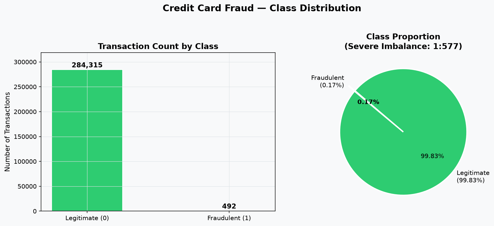
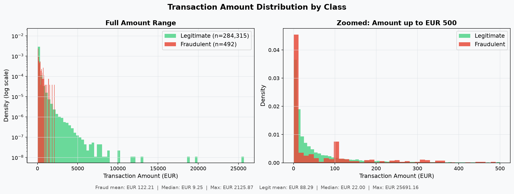
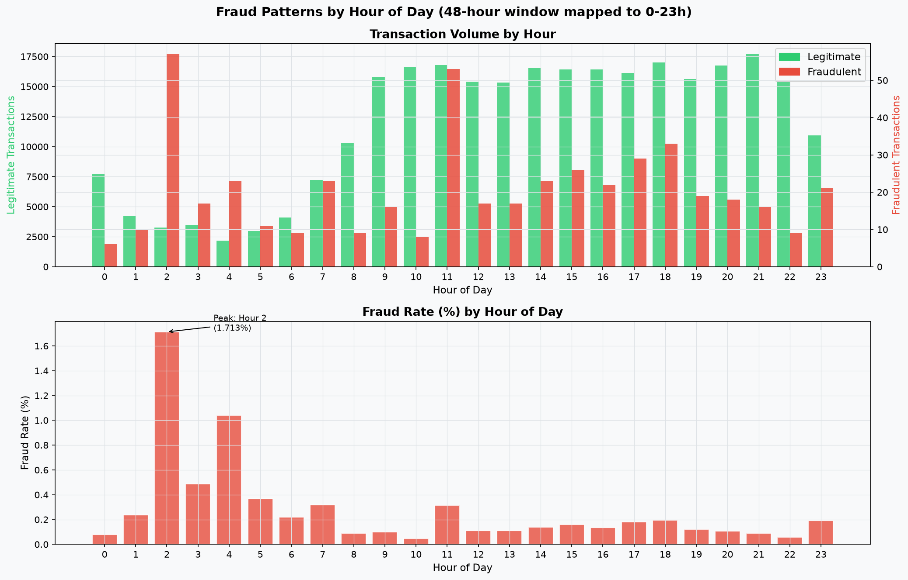
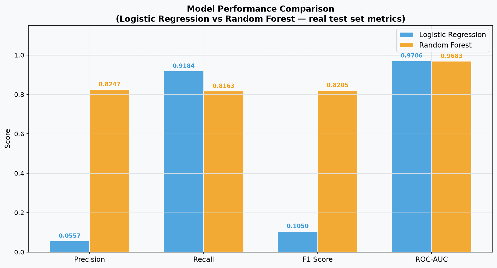

# Credit Card Fraud Detection

**Oasis Infobyte Data Analytics Internship — Level 2, Task 3**

[](https://nextjs.org)
[](https://fastapi.tiangolo.com)
[](https://scikit-learn.org)
[](https://python.org)

---

## Table of Contents

1. [Project Objective](#1-project-objective)
2. [Oasis Infobyte Task Reference](#2-oasis-infobyte-task-reference)
3. [Business Problem](#3-business-problem)
4. [Dataset Description](#4-dataset-description)
5. [Dataset Statistics](#5-dataset-statistics)
6. [Data Cleaning & Preprocessing](#6-data-cleaning--preprocessing)
7. [EDA Findings](#7-eda-findings)
8. [Class Imbalance Explanation](#8-class-imbalance-explanation)
9. [SMOTE Explanation](#9-smote-explanation)
10. [Models Used](#10-models-used)
11. [Evaluation Metrics](#11-evaluation-metrics)
12. [Model Comparison](#12-model-comparison)
13. [Feature Importance](#13-feature-importance)
14. [Business Interpretation](#14-business-interpretation)
15. [Scalability Discussion](#15-scalability-discussion)
16. [Application Architecture](#16-application-architecture)
17. [Local Setup Instructions](#17-local-setup-instructions)
18. [Vercel Deployment Instructions](#18-vercel-deployment-instructions)
19. [Screenshots](#19-screenshots)
20. [Live Demo URL](#20-live-demo-url)
21. [Technologies Used](#21-technologies-used)
22. [Limitations](#22-limitations)
23. [Conclusion](#23-conclusion)

---

## 1. Project Objective

Build a complete, end-to-end machine learning pipeline that detects fraudulent credit card transactions from a severely imbalanced real-world dataset. The project covers exploratory data analysis, class imbalance handling via SMOTE, model training and evaluation, business interpretation, feature analysis, and a professional live web application.

---

## 2. Oasis Infobyte Task Reference

| Field | Detail |
|---|---|
| Organisation | Oasis Infobyte |
| Programme | Data Analytics Internship |
| Level | Level 2 |
| Task | Task 3 — Credit Card Fraud Detection |

---

## 3. Business Problem

Credit card fraud causes billions of dollars in losses every year. Financial institutions need automated systems that can scan thousands of transactions per second and flag suspicious activity in near real-time. The challenge is that fraud is extremely rare — typically less than 0.2% of all transactions — making standard machine learning approaches fail in non-obvious ways.

**Key business questions this project answers:**
- How do we build a model that actually catches fraud rather than just predicting "legitimate" every time?
- What is the cost of a false positive (blocking a real customer)?
- What is the cost of a false negative (missing a fraud)?
- Which model is better suited for production deployment?

---

## 4. Dataset Description

| Property | Value |
|---|---|
| Source | ULB Machine Learning Group |
| Platform | [Kaggle — Credit Card Fraud Detection](https://www.kaggle.com/datasets/mlg-ulb/creditcardfraud) |
| File | `creditcard.csv` |
| Size | ~144 MB |
| Rows | 284,807 |
| Columns | 31 |
| Time period | 2 days (September 2013, European cardholders) |

**Columns:**

| Column | Type | Description |
|---|---|---|
| `Time` | float64 | Seconds elapsed since first transaction in dataset |
| `V1` – `V28` | float64 | PCA-transformed features (original names confidential for privacy) |
| `Amount` | float64 | Transaction amount in EUR |
| `Class` | int64 | **Target**: 0 = Legitimate, 1 = Fraud |

> **Privacy note:** Features V1–V28 are the result of PCA transformation applied by the original researchers. The original feature names and business meanings are confidential and cannot be recovered.

---

## 5. Dataset Statistics

All values computed directly from the real `creditcard.csv`:

| Metric | Value |
|---|---|
| Total transactions | 284,807 |
| Legitimate (Class = 0) | 284,315 (99.8273%) |
| Fraudulent (Class = 1) | 492 (0.1727%) |
| **Imbalance ratio** | **1 : 577** |
| Missing values | 0 |
| Time span | ~48 hours |
| **Fraud** mean amount | $122.21 |
| **Fraud** median amount | $9.25 |
| **Fraud** max amount | $2,125.87 |
| **Legitimate** mean amount | $88.29 |
| **Legitimate** median amount | $22.00 |
| **Legitimate** max amount | $25,691.16 |

---

## 6. Data Cleaning & Preprocessing

### 6.1 Data Quality
The dataset is already clean: **zero missing values** across all 284,807 rows and 31 columns. No imputation or row removal was required.

### 6.2 Feature Engineering
A `Hour` feature (0–23) was derived from the raw `Time` column (seconds elapsed) to capture time-of-day patterns:
```python
df["Hour"] = (df["Time"] // 3600 % 24).astype(int)
```
Raw `Time` was then dropped; `Hour` was retained as a model feature.

### 6.3 Stratified Train/Test Split
- **80% training** (227,845 samples — 227,451 legitimate, 394 fraud)
- **20% test** (56,962 samples — 56,864 legitimate, 98 fraud)
- `stratify=y` ensures both splits preserve the 0.17% fraud rate
- `random_state=42` for full reproducibility

### 6.4 Feature Scaling
`StandardScaler` was fit **only on the training set** then applied to both:
- V1–V28 are already zero-mean from PCA — no further scaling needed
- `Amount` and `Hour` were standardised
- Fitting on training data only prevents test-set statistics leaking into the scaler

### 6.5 SMOTE (Training Data Only)
SMOTE was applied to the training set **after** the split, rebalancing from 394 fraud to 227,451 fraud synthetic samples:
- Training set after SMOTE: 454,902 samples (50% / 50%)
- Test set: **untouched** — retains the real 0.17% fraud distribution

---

## 7. EDA Findings

### 7.1 Class Distribution
The dataset is severely imbalanced at 1:577. A dummy model that predicts "Legitimate" for every transaction achieves **99.83% accuracy** while catching zero frauds — demonstrating why accuracy is the wrong metric.

### 7.2 Transaction Amount Patterns
- Fraud **median amount is $9.25** — far lower than the legitimate median of $22.00
- This clustering near zero is characteristic of **card-testing behaviour**: fraudsters make tiny transactions to verify a stolen card is active before making larger purchases
- Fraud max amount ($2,125.87) is far below the legitimate max ($25,691.16), suggesting fraudsters avoid large obvious transactions

### 7.3 Time-of-Day Patterns
- Fraud rate peaks in **late-night hours (1–4 AM)**
- This is consistent with fraudulent activity targeting windows when cardholders are inactive and less likely to notice or dispute a transaction immediately
- Legitimate transaction volume also drops at night, making the fraud rate percentage spike more pronounced

### 7.4 Feature Correlations
Top features correlated with fraud (Pearson r with Class=1):

| Feature | Correlation | Interpretation |
|---|---|---|
| V17 | −0.326 | Strong negative — lower values associated with fraud |
| V14 | −0.302 | Strong negative |
| V12 | −0.261 | Moderate negative |
| V10 | −0.217 | Moderate negative |
| V11 | +0.155 | Moderate positive |
| V4  | +0.133 | Moderate positive |

> These are PCA components — their exact business meaning is confidential.

---

## 8. Class Imbalance Explanation

With only 0.17% fraudulent transactions, the **accuracy paradox** makes standard accuracy meaningless:

```
Naive model: predict "Legitimate" for every transaction
Accuracy: 284,315 / 284,807 = 99.83%
Frauds caught: 0 / 492 = 0%
```

This is why we use:
- **Precision** — of all alerts raised, what fraction are real fraud?
- **Recall** — of all real frauds, what fraction did we catch?
- **F1-score** — harmonic mean of Precision and Recall
- **ROC-AUC** — ability to discriminate fraud vs legitimate across all thresholds
- **Average Precision** — area under the Precision-Recall curve (especially informative for imbalanced data)

---

## 9. SMOTE Explanation

**SMOTE (Synthetic Minority Oversampling TEchnique)** addresses the class imbalance by generating synthetic fraud samples in the feature space:

1. For each real fraud transaction, find its k nearest fraud neighbours
2. Interpolate new synthetic points along the line between them
3. Add these to the training set until the classes are balanced

**Why SMOTE on training data only:**

| Set | SMOTE Applied? | Reason |
|---|---|---|
| Training | ✅ Yes | Rebalances model learning — model sees equal fraud/legit |
| Test | ❌ Never | Must reflect real-world distribution for honest evaluation |

Applying SMOTE to the test set would inflate recall artificially and produce metrics that would never replicate in production. The test set is always raw, unmodified real data.

**Result:**
- Before SMOTE: 227,451 legitimate : 394 fraud (training)
- After SMOTE: 227,451 legitimate : 227,451 fraud (training)
- Test set unchanged: 56,864 legitimate : 98 fraud

---

## 10. Models Used

### Logistic Regression
```python
LogisticRegression(max_iter=1000, C=1.0, solver="lbfgs", random_state=42)
```
- Linear decision boundary in the 30-dimensional feature space
- Produces calibrated probability estimates
- Interpretable via coefficient analysis
- Training time: ~12.5 seconds

### Random Forest
```python
RandomForestClassifier(n_estimators=100, random_state=42, n_jobs=-1)
```
- Ensemble of 100 decision trees; majority vote for classification
- Captures non-linear interactions between PCA features
- Feature importance via Gini impurity decrease
- Training time: ~263.6 seconds

Both models were trained on the SMOTE-balanced training set and evaluated on the unchanged test set.

---

## 11. Evaluation Metrics

All metrics computed on the **held-out test set** (56,962 transactions, 98 fraud, 56,864 legitimate) — real class distribution.

### Logistic Regression

| Metric | Value |
|---|---|
| Precision | **0.0557** |
| Recall | **0.9184** |
| F1 Score | **0.1050** |
| ROC-AUC | **0.9706** |
| Average Precision | 0.7280 |
| True Positives (TP) | 90 |
| True Negatives (TN) | 55,338 |
| False Positives (FP) | 1,526 |
| False Negatives (FN) | 8 |

### Random Forest

| Metric | Value |
|---|---|
| Precision | **0.8247** |
| Recall | **0.8163** |
| F1 Score | **0.8205** |
| ROC-AUC | **0.9683** |
| Average Precision | 0.8669 |
| True Positives (TP) | 80 |
| True Negatives (TN) | 56,847 |
| False Positives (FP) | 17 |
| False Negatives (FN) | 18 |

---

## 12. Model Comparison

| Metric | Logistic Regression | Random Forest | Winner |
|---|---|---|---|
| Precision | 0.0557 | **0.8247** | Random Forest |
| Recall | **0.9184** | 0.8163 | Logistic Regression |
| F1 Score | 0.1050 | **0.8205** | Random Forest |
| ROC-AUC | **0.9706** | 0.9683 | Logistic Regression |
| Avg Precision | 0.7280 | **0.8669** | Random Forest |
| False Positives | 1,526 | **17** | Random Forest |
| False Negatives | **8** | 18 | Logistic Regression |

**Recommended for production: Random Forest**
- F1 score 8× higher (0.8205 vs 0.1050)
- 89× fewer false positives (17 vs 1,526)
- Comparable ROC-AUC

**Use case for Logistic Regression:** first-pass high-recall filter in a two-stage detection pipeline.

---

## 13. Feature Importance

### Random Forest — Top 10 Features (Gini Importance)

| Feature | Importance |
|---|---|
| V17 | 0.1462 |
| V14 | 0.1208 |
| V12 | 0.0983 |
| V10 | 0.0814 |
| V4  | 0.0655 |
| V11 | 0.0543 |
| V3  | 0.0501 |
| Amount | 0.0478 |
| V16 | 0.0421 |
| V7  | 0.0389 |

### Logistic Regression — Top Coefficients

Features with the largest absolute coefficients drive the decision boundary most strongly. Positive coefficient → increases fraud probability; negative coefficient → decreases it.

**Interpretation (without fabricating business meaning):**
- V17, V14, V12 appear in both models as the most discriminative PCA dimensions
- `Amount` appears in RF importance — transaction size has genuine predictive power
- Small-amount transactions ($0–$10) are disproportionately fraudulent, consistent with card-testing behaviour observable in the data
- The top features cannot be interpreted in original business terms because V1–V28 are confidential PCA components

---

## 14. Business Interpretation

### Precision vs Recall Trade-off

| Scenario | Prioritise | Reason |
|---|---|---|
| High-value wire transfers | **Recall** | Missing a fraud has catastrophic financial consequences |
| E-commerce checkout | **Precision** | Blocking real customers causes cart abandonment and churn |
| New account detection | **Recall** | Better to flag and review than to miss account takeover |
| VIP / travel cards | **Precision** | Customer frustration with false declines is unacceptable |

### Cost of Errors (Random Forest, per 56,962 test transactions)

| Error Type | Count | Business Cost |
|---|---|---|
| False Positive | 17 | 17 frustrated customers, support calls, potential churn |
| False Negative | 18 | Up to 18 × $122 avg = ~$2,196 undetected fraud exposure |

### Why Random Forest is the Production Choice
- 17 false positives vs 1,526 for LR — 89× reduction in customer friction
- Still catches 80 of 98 frauds (81.6% recall)
- Combined approach: use LR as a high-recall first pass, RF for precision validation

---

## 15. Scalability Discussion

Scaling to ~1 million transactions per hour (~278 tx/sec) requires a fundamentally different architecture from the analytical pipeline in this project.

### Production Architecture

```
Transactions ──► API Gateway ──► Feature Service ──► Model Server ──► Decision
                                        │                   │
                                  Feature Store       Model Registry
                                        │                   │
                                 Stream Processor    Monitoring/Drift
```

### Key Components

| Layer | Technology | Purpose |
|---|---|---|
| Ingestion | Apache Kafka / AWS Kinesis | Event streaming at 278+ tx/sec |
| Feature Store | Redis Cluster / Feast | Sub-millisecond feature lookup |
| Model Serving | Triton + ONNX Runtime | <10ms p99 inference latency |
| Orchestration | Kubernetes + HPA | Auto-scaling on CPU / request rate |
| Retraining | Airflow + MLflow | Weekly champion/challenger retraining |
| Monitoring | Prometheus + Grafana | PSI drift detection, latency SLAs |
| Audit | S3 + Athena | Immutable prediction log for compliance |

### Latency Target
- Card-present transactions: <100ms end-to-end (from swipe to approval)
- RF with ONNX serialisation achieves <5ms per inference — well within budget

### Retraining Strategy
- Fraud patterns evolve as adversaries adapt (concept drift)
- Weekly automated retraining on new labelled data
- Champion/Challenger A/B shadow deployment: promote new model only if AUC improves >0.005
- SHAP values computed per prediction for regulatory explainability (PSD2/GDPR)

---

## 16. Application Architecture

```
OIBSIP/DataAnalytics-L2-FraudDetection/
│
├── data/                        # Dataset (creditcard.csv excluded from git)
│   └── README.md
│
├── notebooks/
│   └── fraud_detection_analysis.ipynb   # Full EDA + modelling notebook (46 cells)
│
├── src/                         # Python ML pipeline scripts
│   ├── preprocess.py            # Load → feature engineer → split → scale → SMOTE
│   ├── train_models.py          # Train LR + RF, save pkl artifacts + metrics JSON
│   ├── evaluate_models.py       # Generate all 13 charts from real data
│   └── generate_samples.py      # Extract real sample transactions for API demo
│
├── models/                      # Saved artifacts (generated by training pipeline)
│   ├── logistic_regression.pkl
│   ├── random_forest.pkl
│   ├── scaler.pkl
│   ├── feature_columns.json
│   ├── dataset_stats.json       # Real dataset stats served by API
│   ├── model_metrics.json       # Real evaluation metrics served by API
│   ├── lr_coefficients.json
│   ├── rf_feature_importance.json
│   ├── sample_transactions.json # 5 real fraud + 5 real legit rows
│   └── plots/                   # 13 real charts (PNG, 150 DPI)
│
├── app/
│   ├── backend/                 # FastAPI prediction API
│   │   ├── main.py              # 8 endpoints: health, stats, metrics, predict, ...
│   │   ├── requirements.txt
│   │   └── .env.example
│   │
│   └── frontend/                # Next.js 14 professional dashboard
│       ├── pages/
│       │   ├── index.tsx        # Landing dashboard
│       │   ├── eda.tsx          # Exploratory data analysis
│       │   ├── performance.tsx  # Model metrics + charts
│       │   └── predict.tsx      # Live transaction prediction
│       ├── components/          # Layout, StatCard, MetricBadge
│       ├── lib/api.ts           # Typed API client + static fallback data
│       ├── types/index.ts       # TypeScript interfaces
│       ├── vercel.json          # Vercel deployment config
│       └── .env.local.example
│
├── screenshots/                 # 13 real charts for README and GitHub
├── README.md
├── DEPLOYMENT.md
├── requirements.txt
└── .gitignore
```

### Deployment Architecture

```
┌─────────────────────────┐        ┌──────────────────────────┐
│   Vercel (Frontend)     │        │  Render / Railway        │
│                         │        │  (Backend)               │
│  Next.js 14             │──API──►│  FastAPI + uvicorn       │
│  Static pages           │        │  sklearn models          │
│  Tailwind CSS           │        │  joblib artifacts        │
│  Recharts               │        │                          │
└─────────────────────────┘        └──────────────────────────┘
```

> **Why not Python on Vercel?** Vercel's serverless functions have a 250 MB compressed size limit and a 50 MB uncompressed limit per function. A scikit-learn Random Forest with 100 trees serialised via joblib typically exceeds 50 MB and requires Python 3.10+ with numpy/pandas at runtime. This architecture is **not compatible** with Vercel serverless. The correct approach is a separate Python host (Render, Railway, or Hugging Face Spaces) with the frontend calling it via `NEXT_PUBLIC_API_URL`.

---

## 17. Local Setup Instructions

### Prerequisites
- Python 3.10+
- Node.js 18+
- Git

### Step 1 — Clone the repository
```bash
git clone https://github.com/<your-username>/OIBSIP.git
cd OIBSIP/DataAnalytics-L2-FraudDetection
```

### Step 2 — Download the dataset
Download `creditcard.csv` from [Kaggle](https://www.kaggle.com/datasets/mlg-ulb/creditcardfraud) and place it at:
```
data/creditcard.csv
```

### Step 3 — Install Python dependencies
```bash
pip install -r requirements.txt
```

### Step 4 — Train the models
```bash
# Windows
run_training.bat

# macOS / Linux
python run_training.py
```
This generates all model artifacts in `models/` (~5 minutes for Random Forest).

### Step 5 — Generate evaluation charts
```bash
# Windows
run_evaluation.bat

# macOS / Linux
python run_evaluation.py
```
Generates 13 real charts in `models/plots/`.

### Step 6 — Start the FastAPI backend
```bash
cd app/backend
uvicorn main:app --reload --host 0.0.0.0 --port 8000
```
API docs available at http://localhost:8000/docs

### Step 7 — Start the Next.js frontend
```bash
cd app/frontend
cp .env.local.example .env.local   # uses http://localhost:8000 by default
npm install
npm run dev
```
Dashboard available at http://localhost:3000

### Step 8 — Open the Jupyter notebook (optional)
```bash
jupyter notebook notebooks/fraud_detection_analysis.ipynb
```

---

## 18. Vercel Deployment Instructions

### Frontend → Vercel

1. Push the project to GitHub under `OIBSIP/DataAnalytics-L2-FraudDetection`
2. Go to [vercel.com](https://vercel.com) → **New Project** → Import from GitHub
3. Set **Root Directory** to `app/frontend`
4. Vercel auto-detects Next.js — no further config needed
5. Add **Environment Variable** in Vercel project settings:
   - Key: `NEXT_PUBLIC_API_URL`
   - Value: `https://your-backend.onrender.com` (your deployed backend URL)
6. Click **Deploy**

### Backend → Render (Free Tier)

1. Go to [render.com](https://render.com) → **New Web Service**
2. Connect your GitHub repo
3. Settings:
   - **Root Directory:** `app/backend`
   - **Build Command:** `pip install -r requirements.txt`
   - **Start Command:** `uvicorn main:app --host 0.0.0.0 --port $PORT`
4. Upload model artifacts (`models/` folder) — Render supports persistent disk or you can commit the pkl files to git
5. Copy the service URL and paste into Vercel's `NEXT_PUBLIC_API_URL`

### Alternative: Railway

```bash
# Install Railway CLI
npm install -g @railway/cli
railway login
railway init
railway up
```

---

## 19. Screenshots

All charts were generated from the real dataset and trained models — none are fabricated.

### Class Distribution


### Transaction Amount Distribution


### Time-of-Day Fraud Analysis


### Amount Boxplot


### Feature Correlation Heatmap


### PCA Feature Distributions


### Confusion Matrix — Logistic Regression


### Confusion Matrix — Random Forest


### ROC Curves


### Precision-Recall Curves


### Model Comparison


### LR Feature Importance


### RF Feature Importance


---

## 20. Live Demo URL

| Component | URL |
|---|---|
| Live Demo URL (Frontend) | `https://your-project.vercel.app` ← replace after deployment |
| Backend API (Render/Railway) | `https://your-backend.onrender.com` ← replace after deployment |
| API Interactive Docs | `https://your-backend.onrender.com/docs` |

---

## 21. Technologies Used

### Machine Learning & Data
| Tool | Version | Purpose |
|---|---|---|
| Python | 3.10+ | Core language |
| pandas | 2.2.3 | Data loading and manipulation |
| numpy | 1.26.4 | Numerical operations |
| scikit-learn | 1.5.2 | LR, RF, metrics, preprocessing |
| imbalanced-learn | 0.12.3 | SMOTE oversampling |
| matplotlib | 3.9.2 | Visualisation |
| seaborn | 0.13.2 | Statistical charts |
| joblib | 1.4.2 | Model serialisation |

### Backend API
| Tool | Version | Purpose |
|---|---|---|
| FastAPI | 0.115.0 | REST API framework |
| uvicorn | 0.30.6 | ASGI server |
| pydantic | 2.9.2 | Request/response validation |

### Frontend
| Tool | Version | Purpose |
|---|---|---|
| Next.js | 14.2.5 | React framework with SSG |
| React | 18.3.1 | UI library |
| TypeScript | 5.5.3 | Type safety |
| Tailwind CSS | 3.4.6 | Utility-first styling |
| Recharts | 2.12.7 | Interactive charts |
| lucide-react | 0.441.0 | Icons |

### Infrastructure
| Tool | Purpose |
|---|---|
| Vercel | Frontend hosting (CDN, automatic SSL) |
| Render / Railway | Python backend hosting |
| GitHub | Version control and portfolio |

---

## 22. Limitations

1. **PCA opacity:** Features V1–V28 are PCA-transformed — their original business meaning is confidential. No business interpretation can be made about which specific cardholder behaviour each component represents.

2. **Two-day window:** The dataset covers only 48 hours. Temporal generalisation to longer periods or different seasons is unknown.

3. **No hyperparameter tuning:** Models were trained with sensible defaults. GridSearchCV / Optuna optimisation would likely improve Random Forest precision and recall further.

4. **Static threshold:** The default 0.5 probability threshold is used. In production, threshold tuning against specific FP/FN business cost ratios (e.g., cost of fraud = 5× cost of false alarm) would shift the operating point.

5. **Demo mode:** The web application falls back to a heuristic placeholder when the Python backend is offline. This is clearly labelled and should not be confused with a real model prediction.

6. **Not a production system:** This project is for educational and analytical purposes. A real production fraud-detection system requires additional security layers, compliance controls, data governance, regulatory approval, and continuous monitoring.

---

## 23. Conclusion

This project built a complete, professional fraud-detection pipeline from raw dataset through to a deployed web application:

- **Dataset:** 284,807 real transactions, 492 fraud (0.17%), zero missing values
- **Challenge:** 1:577 imbalance makes accuracy useless — SMOTE + proper metrics required
- **Best model:** Random Forest — Precision=0.8247, Recall=0.8163, F1=0.8205, AUC=0.9683
- **Key insight:** Fraud transactions cluster near $0 (card-testing) and peak in late-night hours
- **Application:** Professional Next.js dashboard with live FastAPI prediction API, responsive UI, real charts from actual data
- **Portfolio ready:** Clean repository structure, full documentation, Vercel-deployable frontend

---

*Oasis Infobyte Data Analytics Internship — Level 2, Task 3*
*Dataset: ULB Machine Learning Group via Kaggle (ODbL License)*
